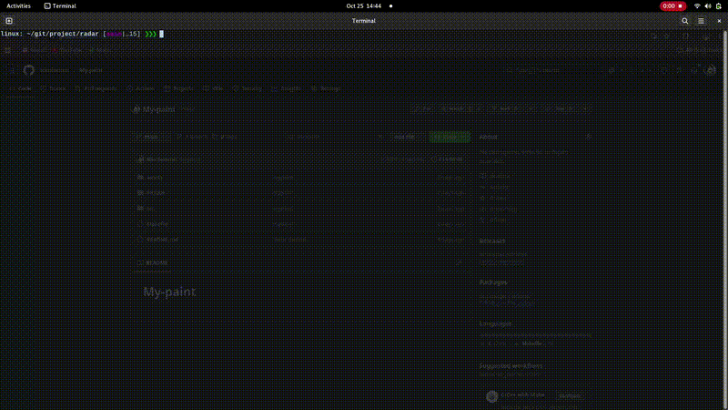

<h1 align="center">🛰️ Radar — Air Traffic Simulation</h1>

<p align="center">
  <a href="#EN">🇬🇧 English</a> • <a href="#FR">🇫🇷 Français</a>
</p>

<p align="center">
  
  
  
</p>

---

### 🎬 Demo

<div align="center">
  
</div>

---

### 🛠️ Build & Run

<p align="center">

| Step / Étape                                         | Command / Commande              | Description                                                                                                                      |
| ---------------------------------------------------- | ------------------------------- | -------------------------------------------------------------------------------------------------------------------------------- |
| 🔹 Compile the project / Compiler le projet          | <code>make</code>               | Compiles all source files and generates `myradar` executable / Compile tous les fichiers source et génère l’exécutable `myradar` |
| 🧹 Clean object files / Nettoyer les fichiers objets | <code>make clean</code>         | Removes temporary files (`*.o`) / Supprime les fichiers temporaires (`*.o`)                                                      |
| ❌ Remove everything / Supprimer tout                 | <code>make fclean</code>        | Removes object files and executable / Supprime les fichiers objets et l’exécutable                                               |
| 🔄 Recompile / Recompiler                            | <code>make re</code>            | Cleans then compiles the project again / Nettoie puis compile à nouveau le projet                                                |
| ▶️ Run the simulation / Lancer la simulation         | <code>./myradar settings</code> | Launches the radar simulation using the configuration file / Lance la simulation radar en utilisant le fichier de configuration  |

</p>

---

### 🗂️ Project Structure

```
.
├── assets/
├── image/
├── include/
├── music/
└── src/
```
---

## 🇬🇧 English <a id="EN"></a>

### 🧠 Overview

**Radar** is a graphical air traffic simulation inspired by *One Piece’s* world, coded in **C** using CSFML.
It simulates moving ships and towers detecting or avoiding collisions within an open world.

#### 🛰️ Purpose

* Simulate ship movement between coordinates.
* Detect collisions between ships (unless in tower range).
* Visualize everything dynamically using CSFML graphics.

#### ⚙️ Entities

* **A (Aircraft / Ship)**: Moves from point A to B at a set speed and delay.
  Example:

  ```
  A 1500 1200 800 700 2.5 15.2
  ```

  → Starts at `(1500,1200)`, heads to `(800,700)` at speed `2.5` after a delay of `15.2`.

* **T (Tower)**: Defines a control tower and its detection radius.
  Example:

  ```
  T 1500 800 45.6
  ```

  → Tower at `(1500,800)` with a range of `45.6`.

#### 🎮 Controls

| Key       | Action                            |
| --------- | --------------------------------- |
| **L**     | Enable/Disable hitboxes and areas |
| **S**     | Enable/Disable sprites            |
| **I**     | Enable/Disable HUD                |
| **Space** | Pause / Play simulation           |

---

### ⚙️ Usage Example

```bash
./myradar settings
```

**Example `settings` file:**

```
A 1500 1200 800 700 2.5 15.2
A 1000 1000 400 300 3.0 8.0
T 1500 800 45.6
T 700 400 60.0
```

Ships will move between given coordinates, avoiding collisions if within a tower’s range.

---

### ⬇️ Download (precompiled version)

<p align="center">
🔹 <strong>Latest ready-to-use version:</strong><br>
<a href="https://github.com/USERNAME/myradar/releases/download/latest/myradar">👉 Download Radar (latest release)</a><br>
<em>Precompiled executable — ready to explore the Grand Line!</em>
</p>

<p align="center">
Or clone the project:<br>
<code>git clone git@github.com:USERNAME/myradar.git</code>
</p>

---

### ✨ Features

* Real-time CSFML graphics
* Customizable `settings` file (unlimited entities)
* Visual collision system
* Toggleable overlays (HUD, sprites, hitboxes)
* Smooth simulation inspired by *One Piece’s* seas

---

### 🧪 CI/CD Workflow

Each push on the `main` branch:

<p align="center">
🔨 Automatically compiles the project <br>
🚀 Publishes the binary to the “latest” release <br>
*(see <code>.github/workflows/build.yml</code>)*
</p>

---

## 🇫🇷 Français <a id="FR"></a>

### 🧠 Présentation

**Radar** est une simulation graphique d'un **trafic aérien** inspirée de l’univers de *One Piece*, codée en **C** avec **CSFML**.
Le programme simule les déplacements de bateaux et les interactions avec des tours de contrôle.

---

### 🎯 Objectif

* Simuler les déplacements entre points fixes.
* Détecter les collisions entre entités.
* Éviter les collisions si les bateaux sont éclairés par une tour.
* Visualiser les trajectoires et zones d’action en temps réel.

---

### 🗺️ Format du fichier `settings`

* **A** pour un avion (ou bateau) :

  ```
  A x_depart y_depart x_arrivee y_arrivee vitesse delai
  ```

  Exemple :

  ```
  A 1500 1200 800 700 2.5 15.2
  ```

* **T** pour une tour :

  ```
  T x y rayon
  ```

  Exemple :

  ```
  T 1500 800 45.6
  ```

Tu peux définir **autant d’avions et de tours que tu veux** dans le fichier `settings`.

---

### 🎮 Contrôles

| Touche     | Action                                   |
| ---------- | ---------------------------------------- |
| **L**      | Activer/Désactiver les hitbox et zones   |
| **S**      | Activer/Désactiver les sprites           |
| **I**      | Activer/Désactiver le HUD                |
| **Espace** | Mettre en pause / relancer la simulation |

---

### ⚙️ Utilisation

```bash
./myradar settings
```

Exemple de fichier :

```
A 1500 1200 800 700 2.5 15.2
A 1000 1000 400 300 3.0 8.0
T 1500 800 45.6
T 700 400 60.0
```

---

### ⬇️ Téléchargement (version compilée)

<p align="center">
🔹 <strong>Dernière version prête à l’emploi :</strong><br>
<a href="https://github.com/USERNAME/myradar/releases/download/latest/myradar">👉 Télécharger Radar (release latest)</a><br>
<em>Exécutable déjà compilé — prêt à explorer Grand Line !</em>
</p>

<p align="center">
Ou cloner le dépôt :<br>
<code>git clone git@github.com:USERNAME/myradar.git</code>
</p>

---

### ✨ Fonctionnalités

* Affichage graphique en temps réel (CSFML)
* Fichier `settings` illimité et personnalisable
* Système de collisions dynamique
* Interface fluide inspirée de l’univers *One Piece*
* Contrôles interactifs pour affichage et simulation

---

### 🧪 Workflow CI/CD

Chaque push sur la branche <code>main</code> :

<p align="center">
🔨 Compile automatiquement le projet <br>
🚀 Publie le binaire dans la release “latest” <br>
🧩 Défini dans <code>.github/workflows/build.yml</code>
</p>
